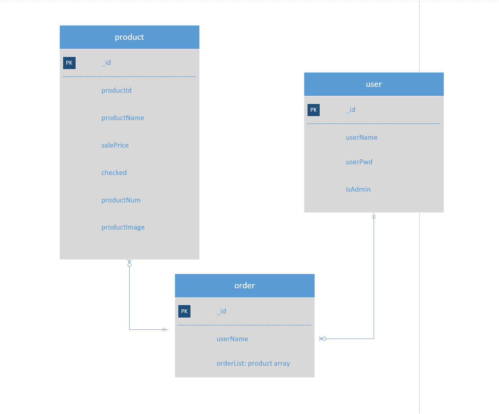

# Assignment 1 - Agile Software Practice.

- Name: Yiyuan Gao
- Student no：20086441
## Link
- [github link](https://github.com/gyyyyyy/flowershop-master-test/)
## Overview.
This project is a backend of a onlinshop app, it could do some basic `CRUD` operations.
Design the RESTful API for the shop
- routes：
    - `general` (./routes/general.js)
    - `admin` (./routes/admin.js)
    - `user` (./routes/user.js)
- test：
    - `admin-order` ./test/functional/api/admin-order.js)
    - `admin-product` (./test/functional/api/admin-product.js)
    - `general-test` (./test/functional/api/general-test.js)
    - `user-test` (./test/functional/api/user-test.js)

## API endpoints.

- `general` (./routes/general.js)
    - GET      -   /general/list      -list all product for index page
    - POST       -  /general/search   -fuzzy search for user
- `admin` (./routes/admin.js)
    - POST      -  /admin/product     -add product
    - GET       -  /admin/product     -get all products
    - GET       -  /admin/product/:id   -get product by id
    - DELETE      - /admin/product/:id   -delete product by id
    - PUT      -  /admin/product/:id     -edit product by id
    - GET     -  /admin/order             -get all orders
    - GET      -  /admin/order/:id        -get order by id
    - DELETE     -  /admin/order/:id      -delete order by id
    - PUT      -  /admin/order/:id      -  edit order by id
       
- `user` (./routes/user.js)
    - POST      -   /user/register    -user register
    - POST       -   /user/login      -user login
    - PUT      -   /user/change      -user change password
    - DELETE      -   /user/:id   -delete user by id
    - GET    -   /user    -list all user
    - GET      -   /user/:id    -get user by id

## Data model.

## Sample Test execution.

~~~
Order

GET /admin/order
      √ should GET all the orders (44ms)
GET /admin/order/:id
      when the id is valid
      √ should return the matching order
      when the id is invalid
      √ should return the NOT found message
DELETE /admin/order/:id
      when the id is valid
        √ should return a message (47ms)
      when the id is invalid
        √ should return the NOT DELETED message
PUT /admin/order/:id
      when the id is valid
        √ should update and return the matching order, return a message
      when the id is invalid
        √ should return a NOT Found message
        
Product
GET /admin/product
      √ should GET all the products
GET /admin/product/:id
      when the id is valid
        √ should return the matching product
      when the id is invalid
        √ should return the NOT found message
DELETE /admin/product/:id
      when the id is valid
        √ should return a message
      when the id is invalid
        √ should return the NOT DELETED message
PUT /admin/product/:id
      when the id is valid
        √ should update and return the matching product, return a message
      when the id is invalid
        √ should return a NOT Found message
POST /admin/product
      √ should return confirmation message and update datastore

General
GET /general/list
    √ should GET all the products
POST /general/search
    when the keyword is valid
    √ should GET all matching products
    when the keyword is valid
    √ should return no result
    
    
User

GET /user
      √ should GET all users
GET /user/:id
      when the id is valid
      √ should return the matching user
      when the id is invalid
      √ should return the NOT found message
DELETE /user/:id
      when the id is valid
        √ should return a message
      when the id is invalid
        √ should return the NOT DELETED message
POST /user/login
      when the username is not registered
      √ should return a message the username is not registered
      when the username is empty
      √ should return a message The username cannot be empty.
      when the password is empty
      √ should return a message The password cannot be empty
      when the username is registered
          when the password is wrong
          √ should return a message the password is wrong
          when the password is correct
          √ should return a token and a message showing successfully login
POST /user/register
      when the username is already in database
      √ should return a message to inform the duplication
      when the username is new
      √ should return a message of successfully add user (1020ms)
PUT /user/change
      when there is no jwt token
      √ should require to login if it does not have a jwt token
      when there is a jwt token
          when the token is invalid
          √ should return an invalid error
          when the token is valid
              when the username is not registered
              √ should return a message the username is not registered
      when the username is registered
      √ should return a message of successfully update user

34 passing (8s)

~~~

## Extra features.

- Authentication: 
    - The project uses `jsonwebtoken` as a way of authentication, each api that needs authentication should put a token in the request body to be verified.
- Automated testing:
    - Using `mocha` and `lodash` to do automated testing.
- Code quality:
    - Using `eslint` to check and obey the `code standard`.
    - Using `nyc` to generate `code coverage report`.
- Others:
    - Using `babel` to `compile` and support `es6 grammar`.
    - Using `cross-env` to enable `platform independence`.
    - Using `nodemon` and `eslint-watch` to `watch` the `file changes` of a project and perform `hot reboot`.
## PS:
~~~
The part of the data that is inserted asynchronously before the test is sometimes error-prone and may time out or cause other problems. It takes multiple tests to pass!
~~~
